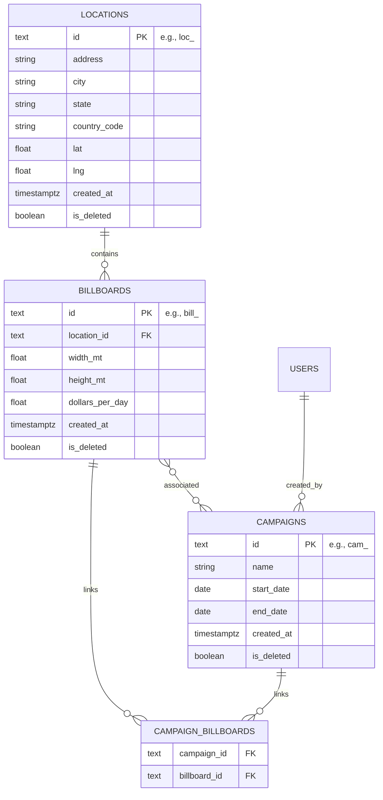

# API Design for an Out-of-Home Advertising System (Billboards Rental Company)

## Business Logic

The company rents or owns locations where it places one or more billboards that it then rents for advertising. This API aims to provide a way to load locations, asign billboards to those locations and then create campaigns that take up a certain number of those billboards.
It checks availability (based on overlaping dates) and calculates campaign cost based on per-day rental costs for each billboard.

To make the task manageable in the given time a lot of the business logic was overly simplifyied. All users are assumed to be employees of the company with admin privileges so the user is given access to all locations, billboards and campaigns. There is no role based security and user authentication was delegated to a third party (Supabase).

## Features

### Database

- **Type**: Supabase PostgreSQL.
- **Tables**:
  - `locations`: id (PK, TEXT, e.g., `loc_<uuid>`), address, city, state, country_code, lat (float), lng (float), created_at (TIMESTAMPTZ), is_deleted (BOOLEAN, default false).
  - `billboards`: id (PK, TEXT, e.g., `bill_<uuid>`), location_id (FK, TEXT), width_mt (float), height_mt (float), dollars_per_day (float), created_at (TIMESTAMPTZ), is_deleted (BOOLEAN, default false).
  - `campaigns`: id (PK, TEXT, e.g., `cam_<uuid>`), name, start_date (DATE), end_date (DATE), created_at (TIMESTAMPTZ), is_deleted (BOOLEAN, default false).
  - `campaign_billboards`: campaign_id (FK, TEXT), billboard_id (FK, TEXT).
- **Relationships**: Many-to-many between `campaigns` and `billboards` via `campaign_billboards`, with date-based exclusivity.

### API

- **Features and characteristics**:

  - Built with FastAPI
  - **Separation in Layers**:
    - **Presentation**: FastAPI routes, JSON responses, HTTP status codes, Swagger docs.
    - **Application**: Service layer for denormalization, cost calculation, etc.
    - **Domain**: Pydantic models
    - **Persistence**: SQLModel for ORM, repository pattern with generics.
  - Swagger docs available at `/docs`
  - Soft deletion (`is_deleted = true`)
  - Locks dependencies using `poetry`.
  - `Alembic` for db migrations.
  - Pagination: Fixed-size (offset/limit)
  - Filtering: Query params (`/availability?start_date=&end_date=` or `/availability?campaign_id=`).
  - Versioning: `/api/v1/`
  - HATEOAS: Includes links in most responses. self, actions & related. (links: { actions: { name, method, href...}, ...})
  - Authentication: Supabase Auth (JWT, email/password)
  - Highly available through the use of uvicorn
  - Rate Limiting: Per-user (100 requests/min) with `slowapi` and `redis`
  - Uses dependency injection and repository pattern with generics.
  - Uses Type-Hints throught the code.

- **Endpoints**:

  (unprotected)

  - `/auth/sign-up`, `/auth/sign-in`, `/auth/sign-out`: POST { email, password }
  - `/health`: Healthcheck
  - `/version`: Version info

  (protected)

  - `/locations/`: GET (list, exclude `is_deleted = true`, accepts `?limit=&offset=`), POST, GET `{id}`, PUT `{id}`, DELETE `{id}`
  - `/billboards/`: GET (list, exclude `is_deleted = true`, accepts `?limit=&offset=`), POST, GET `{id}`, PUT `{id}`, DELETE `{id}`
  - `/billboards/availabile?campaign_id={camp_id}`: GET (list, exclude `is_deleted = true`, filters availability for this campaigns dates, and provides actionable links to add the listed billboards to a campaign)
  - `/billboards/available?start_date={YYYY-MM-DD}&end_date={YYYY-MM-DD}`: GET (list, exclude `is_deleted = true`, filters availability for the given dates)
  - `/campaigns/`: GET (list, exclude `is_deleted = true`, accepts `?limit=&offset=`), POST, GET `{id}`, PUT `{id}`, DELETE `{id}`
  - `/campaigns/`: GET (list, exclude `is_deleted = true`, accepts `?limit=&offset=`), POST, GET `{id}`, PUT `{id}`, DELETE `{id}`
  - `/campaigns/{camp_id}/add/{bill_id}`: POST (adds a billboard to a campaign)
  - `/campaigns/{camp_id}/remove/{bill_id}`: POST (removes a billboard from a campaign)

### FRONTEND

- built with Vite React
- Typescript throught the code.
- Types the models from the Domain layer
- Uses react-router
- Global state management deemed not necessary at this point
- Allows for all CRUD operations

### DEPLOYMENT:

- **Docker container**: Run with `docker-compose up --build --detach` from root directory.
  - backend: localhost:8000
  - swagger-docs: localhost:8000/docs
  - frontend: localhost:3000
